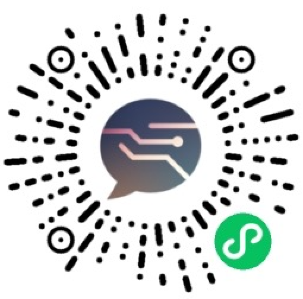

小聆AI | 听懂你的声音，看懂你的世界
==============================

## 小聆AI介绍

小聆AI是聆思面向桌面机器人和陪伴类设备打造的智能语音交互方案，专为打造更拟人、更懂你、更智能的语音交互体验而设计。

它具备以下核心特点：

1. 角色更拟人：响应更快，对话更自然；支持情感发音人；支持声音复刻，实现个性化定制。
2. 对话更懂你：基于声纹精准识别用户身份；构建用户画像，记录兴趣与偏好；支持长期记忆，越用越懂你。
3. 对话更智能：支持联网搜索、百科类问答。
4. 配套服务完善：小程序支持查看对话记录与用户画像；可自由切换AI人设，满足多样化陪伴需求。

## 效果演示

[B站：小聆AI演示视频](https://www.bilibili.com/video/BV18QtJz4ET5/)

## 搭建你的专属应用

打造一个你专属的小聆AI应用请参考教程[《如何接入小聆AI》](https://docs2.listenai.com/x/S_TEd8h7C)。

## 接入你的设备

如果你有ESP32开发套件，可参考教程 [《ESP32接入小聆AI教程》](https://zhuanlan.zhihu.com/p/1936115549143823284)完成设备配置和接入。

## 绑定小程序

开启长期记忆与声纹识别后，通过小程序绑定设备，即可查看当前设备的记忆数据，以及基于声纹识别生成的用户画像记录。

#### 访问小程序、

用微信扫描小程序码或微信搜索**小聆助手**，点击**添加设备**选择**大模型开发套件**完成绑定。

## 获取帮助

如在接入过程中遇到问题，或有商务合作需求，可添加下方微信联系官方人员。

## 学习交流

欢迎加群交流：757605977，我也会持续维护项目，推出更多有趣的新功能。

## 致谢

本项目 Fork 自 [78/xiaozhi-esp32](https://github.com/78/xiaozhi-esp32)，在其基础上进行适配与扩展，感谢原作者的开源贡献。
